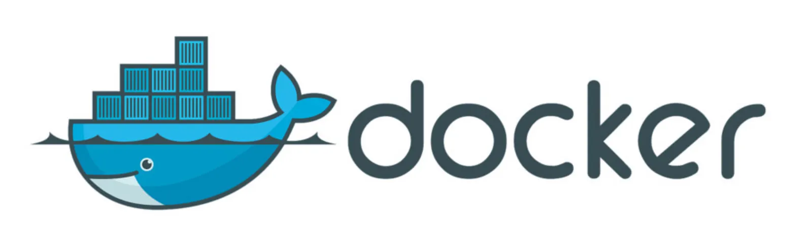
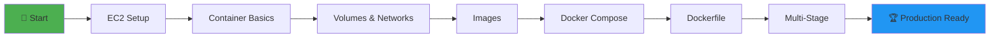

# 🐳 Docker Mastery Journey

<div align="center">




**A comprehensive Docker learning series from zero to hero**

[Getting Started](#-getting-started) •
[Projects](#-projects) •
[Roadmap](#-learning-roadmap) •
[Contributing](#-contributing)

</div>

---

## 📚 About

This repository is a comprehensive collection of Docker learning materials that I've prepared to master Docker **from fundamentals to advanced level**. Each folder contains practical examples and detailed explanations covering specific Docker topics.

> 💡 **Learning Philosophy:** Each project builds upon the previous one. It's recommended to follow them in order!

## ⚡ Quick Start

```bash
# Clone the repository
git clone https://github.com/babaktanriverdi/DevOps_Docker.git

# Navigate to a project
cd DevOps_Docker/

# Read and learn!
cat README.md
```

## 🎯 Projects

### 🌱 Beginner Level

<table>
<tr>
<td width="50%">

#### 📦 [Docker Basics](./S1A-docker-01-installing-on-ec2-linux2)
**Docker Installation on AWS EC2**
- ✅ EC2 instance preparation
- ✅ Docker installation
- ✅ Running first container

</td>
<td width="50%">

#### 🔄 [Container Operations](./S1B-docker-02-container-basic-operations)
**Container Lifecycle**
- ✅ Start, stop, restart
- ✅ Logs and debugging
- ✅ Container management

</td>
</tr>

<tr>
<td>

#### 💾 [Volume Management](./S2-docker-03-handling-volumes)
**Data Persistence**
- ✅ Named volumes
- ✅ Bind mounts
- ✅ Volume backup & restore

</td>
<td>

#### 🌐 [Networking](./S3-docker-04-network)
**Container Communication**
- ✅ Bridge networks
- ✅ Host networking
- ✅ Container connectivity

</td>
</tr>
</table>

### 🚀 Intermediate Level

<table>
<tr>
<td width="50%">

#### 🏗️ [Image Operations](./S4-docker-05-image-basic-operations)
**Image Management**
- ✅ Pull & push images
- ✅ Image inspection
- ✅ Tag management

</td>
<td width="50%">

#### 🎼 [Docker Compose](./S5A-docker-06-compose-operations)
**Multi-Container Apps**
- ✅ docker-compose.yml
- ✅ Service orchestration
- ✅ Environment variables

</td>
</tr>

<tr>
<td>

#### 📝 [Dockerfile Basics](./S5B-docker-07-dockerize-to-do-app-on-python-flask-mysql)
**Custom Image Building**
- ✅ Python Flask app
- ✅ MySQL integration
- ✅ Multi-tier architecture

</td>
<td>

#### 🛠️ [Dockerfile Commands](./docker-11-build-image-with-ENV-and-ARG)
**Build Arguments**
- ✅ ENV vs ARG
- ✅ Build-time variables
- ✅ Runtime configuration

</td>
</tr>
</table>

### 🎓 Advanced Level

<table>
<tr>
<td width="50%">

#### ⚙️ [EXEC vs CMD](./docker-10-difference-between-exec-for...)
**Container Entry Points**
- ✅ Shell form vs Exec form
- ✅ Process management
- ✅ Signal handling

</td>
<td width="50%">

#### 📊 [Docker Stats](./docker-15-docker.top_stats-cp-diff-com...)
**Resource Monitoring**
- ✅ CPU & memory tracking
- ✅ Container diff
- ✅ Performance analysis

</td>
</tr>

<tr>
<td>

#### 🏗️ [Multi-Stage Builds](./docker-14-multi-stage-builds)
**Optimized Images**
- ✅ Build optimization
- ✅ Layer caching
- ✅ Smaller image sizes

</td>
<td>

#### 📤 [Commit & Export](./docker-16-docker-commit-export-impor...)
**Image Portability**
- ✅ Container to image
- ✅ Import/export
- ✅ Image sharing

</td>
</tr>

<tr>
<td>

#### 📜 [Docker Logs](./docker-13-docker-logs-command_and_e...)
**Log Management**
- ✅ Log drivers
- ✅ Log rotation
- ✅ Debugging strategies

</td>
<td>

#### 🕐 [Office Hours](./docker-office-hours)
**Q&A Sessions**
- ✅ Common issues
- ✅ Best practices
- ✅ Real-world scenarios

</td>
</tr>
</table>

## 📈 Learning Roadmap



## 🎯 Learning Objectives

With this repository, you will learn:

- ✨ **Docker Fundamentals**: Core container technology concepts
- 🏗️ **Image Creation**: Building custom Docker images
- 🔄 **Container Orchestration**: Multi-container applications
- 🚀 **Production Best Practices**: Security and optimization
- 📊 **Monitoring & Debugging**: Problem-solving and analysis
- 🎓 **Real-world Applications**: Practical projects

## 🛠️ Prerequisites

```yaml
Minimum:
  - Docker: ≥ 20.10
  - Docker Compose: ≥ 2.0
  - Git: Latest
  - Linux knowledge: Basic

Recommended:
  - AWS Account: (for EC2 projects)
  - Python: ≥ 3.8
  - Code Editor: VS Code + Docker extension
```

## 📖 How to Use?

### 1️⃣ Sequential Learning (Recommended)
```bash
# Start from S1A and progress in order
cd S1A-docker-01-installing-on-ec2-linux2
cat README.md
# Complete the exercises
# Move to next folder
```

### 2️⃣ Topic-Based Learning
```bash
# Jump directly to a topic of interest
cd docker-14-multi-stage-builds
# Read the README
```

### 3️⃣ Hands-On Practice
```bash
# In each project folder:
docker-compose up -d    # Start the application
docker logs -f [container]  # Monitor logs
docker exec -it [container] sh  # Connect to container
```

## 🌟 Featured Projects

### 🔥 [Flask + MySQL Todo App](./S5B-docker-07-dockerize-to-do-app-on-python-flask-mysql)
> Full-stack web application with Docker Compose and multi-container orchestration

**What you'll learn:**
- Multi-tier architecture
- Database persistence
- Environment configuration
- Service dependencies

### ⚡ [Multi-Stage Build Example](./docker-14-multi-stage-builds)
> Building production-ready images with size optimization

**What you'll learn:**
- Build optimization
- Layer caching strategies
- Security best practices
- Image size reduction (500MB → 50MB)

## 💡 Tips and Best Practices

<details>
<summary>🎯 Container Naming</summary>

```bash
# ❌ Bad
docker run redis

# ✅ Good
docker run --name my-redis-cache redis:alpine
```
</details>

<details>
<summary>🔒 Security</summary>

- Use non-root users
- Don't store secrets in environment variables
- Prefer official base images
- Update images regularly
</details>

<details>
<summary>📦 Image Size Optimization</summary>

- Use Alpine base images
- Implement multi-stage builds
- Use .dockerignore
- Clean up unnecessary files
</details>

## 📊 Project Statistics

```
📁 Total Projects: 16+
⏱️ Estimated Time: 40+ hours
🎯 Difficulty: Beginner → Advanced
🌍 Language: English + Turkish
```

## 🤝 Contributing

Contributions are welcome! 

1. 🍴 Fork the project
2. 🌿 Create a feature branch (`git checkout -b feature/amazing-feature`)
3. 💾 Commit your changes (`git commit -m 'feat: Add amazing feature'`)
4. 📤 Push to the branch (`git push origin feature/amazing-feature`)
5. 🎉 Open a Pull Request

### Areas Where You Can Contribute

- 📝 Documentation improvements
- 🐛 Bug fixes
- ✨ New example projects
- 🌍 Translations
- 🎨 Diagrams and visuals

## 📜 License

This project is licensed under the MIT License. See the [LICENSE](LICENSE) file for details.

## 🙏 Acknowledgments

If you found this repository useful, don't forget to give it a ⭐!

---

<div align="center">

**🐳 Happy Dockerizing!**

Feel free to [open an issue](../../issues) for questions

Made with ❤️ and lots of ☕

</div>
